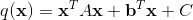
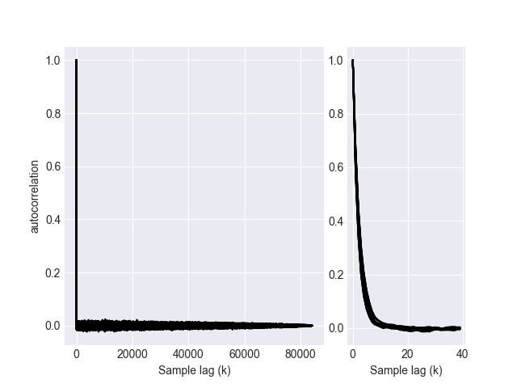
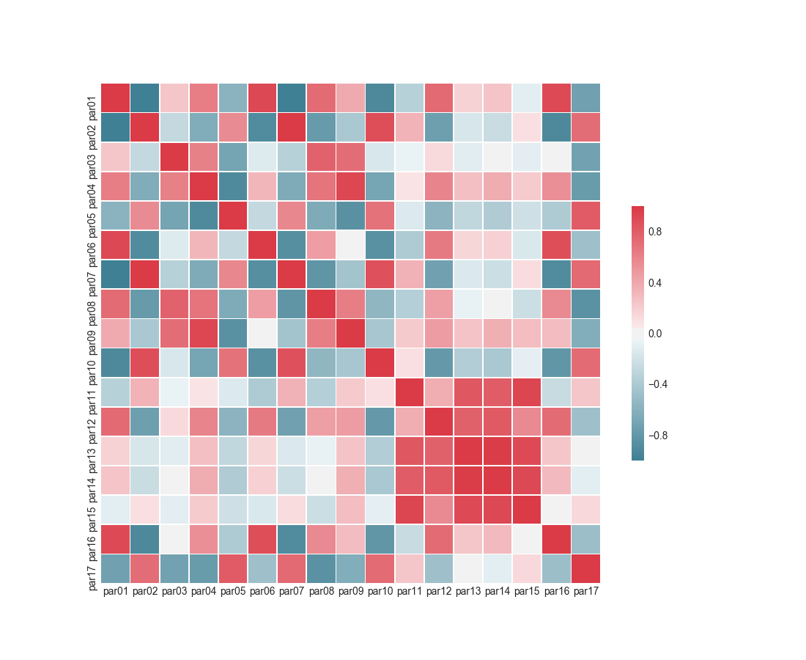
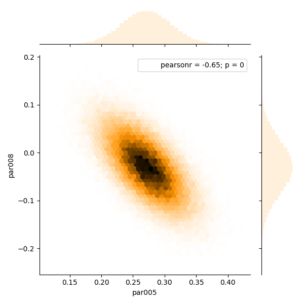

# Hamiltonian Monte Carlo Probabilistic inversion of linear models

This program is built to perform Markov Chains using Hamiltonian Mechanics. Essentially, any amount of
parameters and any linear forward model matrix can be supplied, as long as one can describe the system in quadratic form;

   (1)

Typically, the matrix A has to be positive definite, for a posterior probabilty to be well defined in 
model space. Typically, this quadratic form is the result of using Bayes' Theorem in conjuction with 
a linear model and some prior information. More is described in the reader. 

The latest implementation (on the 'ABC' branch) uses the Armadillo Linear Algebra Library 
to do multithread linear algebra operations. This code has been succesfully tested for models
up to 10201 parameters. A detailed documentation is as of yet not complete, but for a general idea how
to set up an inversion I do recommend looking in the subfolder inversions.

## Sample results

Autocorrelation of a single HMC chain:


Correlation matrix of particular inversion result:


Marginal of posterior solution:


## Hamiltonian Monte Carlo

There are a lot of good texts on Hamiltonian Monte Carlo. My favourites include Radform Neal's chapter 
in the **Handbook of Markov Chain Monte Carlo** (by Brooks et al.) for the basics of constructing a 
Markov Chain using HMC and  Albert Tarantola's book on **Inverse Problem Theory and methods for Model 
Parameter Estimation** for the basics of probabilistic inversion and an introduction to Markov Chain 
appraisals of posteriors. The references are given below.

A great visualization of the algorithm is available at Alex Rogozhnikov's 
[GitHub hosted blog](http://arogozhnikov.github.io/2016/12/19/markov_chain_monte_carlo.html).

A theoretical introduction will soon be present.

## Implementation specifics

### Current work
The effectiveness of the method depends mostly on the choice of mass matrix. It turns out that the
optimal mass matrix is the systems Hessian. For a linear problem, solving the Hessian of the Bayesian 
formulation is the same as obtaining the full solution. It is therefore quite backwards to solve the
linear system by computing the Hessian, after which we can use this as a mass matrix to compute the 
solution. 

An alternative is having an estimate of the diagonal entries of the Hessian; the variances of each 
model parameter. These are relatively cheap to compute if the prior and data covariances are diagonal. 
This is currently being implemented.

Despite all this, this software does provide an easy way to estimate posterior covariances and 
cross-correlations. The algorithms still works on sytems which are not positive definite, and the 
results of the Hamiltonian Monte Carlo algorithm might give some insight as to which parameters are 
problematic (testing a null-space for example).

### Prerequisites

Make sure that BLAS and LaPACK are available on your system, as well as the Armadillo library. 

A full installation guide is provided below.

### Downloading and preparing

To get started there's basically two things needed on a standard Linux PC; Armadillo and the project source 
files. We also need BLAS and LaPACK for speed but usually these packages are available. If not, there's a ton 
of resources online, but I also don't want to be the one who constantly points to Google: if you're having 
trouble, contact me.

So, to start doing some cool Markov Chains what I suggest you do is create a working folder on your machine, 
name it anything in any location. To this folder we're going to do 2 git checkouts. If you obtained the 
project in any other way (e.g. usb) you probably end up with the same folders.

First you should git checkout Armadillo; conradsnicta/armadillo. The repo can be found 
[here](https://github.com/conradsnicta/armadillo).

Alternatively you can use your package manager to install it (like apt):
```{r, engine='bash', Installing Armadillo using a package manager}
sudo apt install libarmadillo-dev libarmadillo7 
```

This requires you to modify the CMakeLists.txt slightly. It is shown in the folder **alt/**. 

Subsequently, you should check out this repository (specifically the ABC or master branch). In the end, 
the two git repo's should end up next to each other (if you installed Armadillo using git, otherwise it's 
just one folder):

```
- main_project_folder/
| - armadillo-code/
| - hmc-linear-systems/
```

### Compilation

**Armadillo**:

First we need to compile Armadillo for your system. We're going to use a simple linking method which doesn't 
require placing Armadillo in any path. (This differs a little if you installed it using a package manager, 
you don't have to compile Armadillo. Again, check out the folder **alt**.) 

Go to the **armadillo-code/** folder and perform the following commands (the output is interesting as it will 
tell you something about the optimization):

```{engine='bash'}
cmake .
make armadillo
```

If that goes uneventful, Armadillo is compiled!

**hmc-linear-systems**:

This project works really neatly in CLion or other CMake enabled IDEs.

All build targets can easily be prepared with CMake. Using at least CMake 3.7 allows you to run (from the
project root directory);

```{r, engine='bash', Running CMake}
cmake . -DCMAKE_BUILD_TYPE=Release
```

This automatically prepares optimizations such as 'O3' and should typically be used. 
If you're having problems try: 
```
cmake . -DCMAKE_BUILD_TYPE=Debug
```

and debug from your choice of debugger. 

This prepares the platform dependent compilation instructions. For example, on Linux one would now run for
 all separate targets (as of yet only one target exists):

 ```{r, engine='bash', Building targets}
 make hmc_sampler
 ```

### Execution

All targets are compiled into **bin/**. Running the bash scripts should be done from this folder as such:
```{r, engine='bash', Building targets}
  ../inversions/inversion1.bash
```

This creates a file containing the samples by row, augmented with misfit value as such;
```
{parameter_1,sample_1} {parameter_2,sample_1} ... {misfit,sample_1}
{parameter_1,sample_2} {parameter_2,sample_2} ... {misfit,sample_2}
{parameter_1,sample_3} {parameter_2,sample_3} ... {misfit,sample_3}
```
These values are floats and space separated. They can be easily loaded into e.g. NumPy using loadtxt().
 
I highly recommend making a new inversion bash file for each inversion, and changing the file/folder 
names. The script doesn't automatically make new folders, so if you want to do a new inversion, you 
should create a separate folder in **bin/**.

### Visualization and diagnostics

Multivariate Markov Chains can be visualized in beautiful and colorful ways and everyone does it differently.
I have provided some scripts, one in R for effective sample sizes, Python for the rest, to visualize the
chain in what I believe is an intuitive way.

The R scripts uses the coda and mcmcse packages. Expecially the implemntation from the multivariate effective
sample size is rather novel. It is implemented using the methods in Vats et al. (2017).

**Effective sample size**

One of the most important things to check is if a chain is converged. One way (of many) to do this is to
compute the effective sample size. Have we produced enough uncorrelated samples to accurately infer 
properties? The computation of this quantity is done in the R-script mess.r (multivariate effective samples 
size, not just a mess ;)  ). From the **bin/** folder:

```
Rscript ../analysis/mess.r
```

For a sufficiently large chain, this script might take some tens of seconds. Vats et al. (2017) 
also provided a criterium to calculate a required effective sample size. This is also performed in
this script.

If one requires more visualization on chain diagnostics, I highly recommend the **coda** R package.

**Chain visualization**

Visualizing the state of the Markov Chain is another way to get a good feeling of how MCMC works as 
well as to perform diagnostics. In the python script chain.py I have provided ways to look at the 
samples and autocorrelations of each parameter. For this, I use the interactive mode of matplotlib;
each time you close a figure, the new one will be generated. The code can be modified easily to save
the figures in any required format. This can also be done from the GUI (as the plot is being shown).

From **bin/** (with substituting the filenames/folders):
```
 python analysis/chain.py inversionFolder/samplesFile.txt
```

**Bayesian inference**

The actual analysis of parameters is done typically with visualizing the means and 
correlation/covariance matrix. These paremeters completely define the posterior multivariate Gaussian.
It is visualized in the following way from the **bin/** folder:
```
 python analysis/inference.py inversionFolder/samplesFile.txt
```

Same things happen as with chain.py.

### Citation

If this code was helpful to one of your programmes I enjoy hearing about it! If you use the actual code
to construct Markov Chains, I'd appreciate a reference to my latest work on it:

```
Implementation and tuning of Hamiltonian Monte Carlo for large linear inverse problems
Geophysical Research Abstracts
Vol. 20, EGU2018-14600, 2018
EGU General Assembly 2018
© Lars Gebraad, Andreas Fichtner 2018. CC Attribution 4.0 license.
```

### FAQ's

Not many people have asked me questions yet. Feel free though!

### References

```
Multivariate Output Analysis for Markov chain Monte Carlo
D. Vats, J. M. Flegal, G. L. Jones, 2017
arXiv:1512.07713v4
https://arxiv.org/abs/1512.07713v4

R. M. Neal et al. 
MCMC using Hamiltonian dynamics. 
Handbook of Markov Chain Monte Carlo, 2(11), 2011.

A. Tarantola. 
Inverse problem theory and methods for model parameter estimation, 
volume 89. SIAM, 2005.
```

